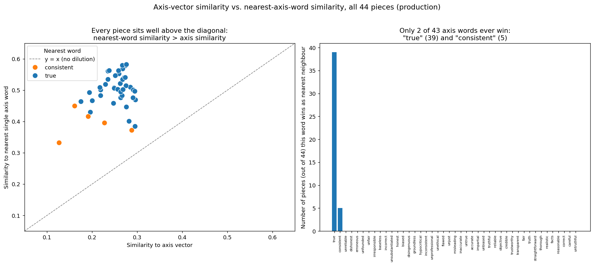
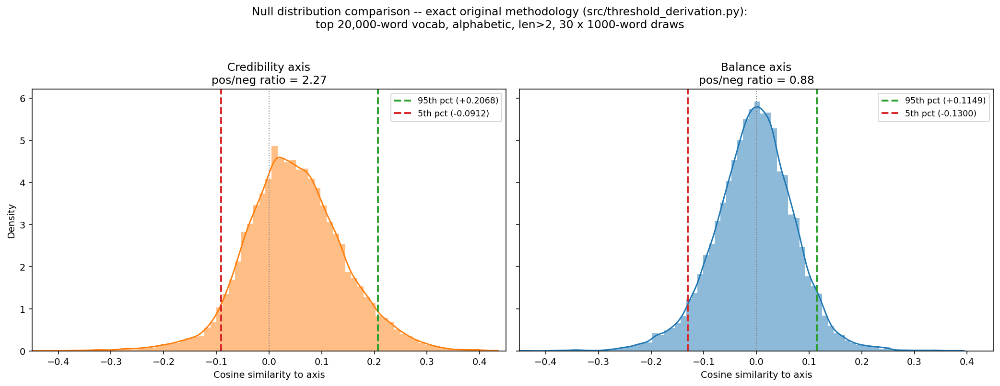

# Relative Semantic Framing via Axis Projection

**Can journalistic credibility be measured with static GloVe embeddings?**

An explainable NLP pipeline that scores news articles by projecting them onto a semantic axis
built from GloVe word embeddings — and an honest account of where that method holds up and where
it breaks.

MSc Artificial Intelligence dissertation (IS4T702), University of South Wales.
Supervisor: Dr Mabrouka Abuhmida.

---

## Table of contents

- [Overview](#overview)
- [Research question](#research-question)
- [Method](#method)
- [Key findings](#key-findings)
- [Repository structure](#repository-structure)
- [Installation](#installation)
- [Usage](#usage)
- [Data, copyright and ethics](#data-copyright-and-ethics)
- [Limitations](#limitations)
- [AI-assisted development](#ai-assisted-development)
- [Key references](#key-references)

---

## Overview

A news article can be one-sided in *which* facts it selects, how it frames them, and what it omits,
even when every individual fact is true. This project asks whether that kind of framing leaves a
measurable footprint in an article's word choice, and whether it can be measured in a way a reader
can actually inspect — no black-box classifier between the text and the number.

The approach follows the semantic projection line of work (Grand et al., 2018; Kozlowski et al.,
2019): define a direction in embedding space from two opposing sets of words, compress each
document into a single vector, and measure the cosine similarity between the two.

The headline result is a **negative one, reported as such**: the credibility axis does not measure
credibility. It is dominated by a single component of its own definition and is asymmetric by
construction. What the pipeline can measure is *relative semantic framing* — hence the title.

## Research question

> Can journalistic credibility be measured with static GloVe embeddings?

Three sub-questions structure the work:

1. Does TF-IDF weighting meaningfully improve compressed document representation?
2. Is a theory-grounded credibility axis structurally sound in embedding space?
3. Does isolating a single dimension (balance) behave better than a multi-dimensional one?

## Method

**1. Axis construction.** Two word groups are averaged (each vector unit-normalised first) and
subtracted, following Kozlowski et al.'s "grouped pairs" method:

```
axis = mean(credible words) − mean(non-credible words)
```

The credibility axis uses 21 credible vs 22 non-credible adjectives grounded in BBC editorial
guidelines (`honest`, `accurate`, `impartial`, `truthful`… vs `dishonest`, `biased`, `misleading`,
`unsubstantiated`…). Unsupervised selection (agglomerative hierarchical clustering, k-means) was
trialled first and rejected: clusters merged antonyms with synonyms because GloVe encodes
co-occurrence, not valence — `tarnish` and `reputation` landed in the same cluster.

A second, narrower **balance axis** (7 vs 7) was built later to isolate one dimension:
`balanced/measured/proportionate/restrained/even-handed/moderate/calm` vs
`unbalanced/exaggerated/disproportionate/sensational/one-sided/extreme/dramatic`.

**2. Preprocessing.** spaCy tokenisation and lowercasing, named-entity removal (statistical NER
plus an `EntityRuler` denylist for subject names, organisations and outlet names), and — depending
on the variant — POS-tag filtering or stopword removal.

**3. Compression.** Each token's GloVe vector is unit-normalised, multiplied by its weight, and
averaged into one 300-dimensional document vector.

**4. Projection.** Cosine similarity between the document vector and the axis vector gives the
score.

**5. Zone segmentation** (Corpus A only). Each article is split by the inverted-pyramid structure
into headline+lead, body, tail (last two paragraphs) and whole document — 11 articles × 4 zones =
44 pieces.

### Weighting schemes compared

| Scheme | Weight function | Kept as |
|---|---|---|
| Flat | TF only | Floor case |
| Production | Corrected TF-IDF (continuity correction, high-TF cap) + POS filter | Baseline |
| Standard | Plain TF-IDF + stopword removal | Reference baseline |
| Axis-similarity | \|cos(token, axis)\| | Rejected |
| Product hybrid | TF-IDF × \|cos(token, axis)\| | Middle point |
| **Threshold-cosine** | TF-IDF, gated by a cosine relevance threshold | **Primary method** |

### Corpora

| | Corpus A | Corpus B |
|---|---|---|
| Content | Jannik Sinner doping settlement | 2022 World Cup match reports |
| Size | 11 articles, 11 outlets | 53 articles, 1 outlet |
| Date | All 15 February 2025 | 2022 tournament |
| Words/article | 676.5 mean (397–1257) | 482.3 mean (126–844) |
| Segmentation | 4 zones per article | Whole document only |

A public-domain 1898 propaganda text (*"Destruction of the War Ship Maine Was the Work of an
Enemy"*) is included throughout as a control: a document whose framing is unambiguously unbalanced.

## Key findings

**TF-IDF weighting works for long-document compression.** Against an unweighted baseline, TF-IDF
widened the score range of article bodies by **3.86×** and whole documents by **3.08×**, with a
mean rank shift of **4.73 of 44** positions. Short zones barely moved — the gain is specifically in
recovering distinctiveness from long, diluted text. Removing POS filtering instead produced only a
2.41 rank shift, isolating weighting as the dominant factor.

**But TF-IDF is blind to axis relevance.** The median cosine-to-axis of top TF-IDF-weighted tokens
was **0.1411**, against **0.3447** for axis-similarity weighting — a 59% relevance gap. Corpus
rarity is not the same as relevance: `number` and `mr.` were repeatedly top-weighted.

**Weighting purely by axis relevance fails differently.** Top tokens collapsed to near-duplicates —
`able` and `provide` accounted for **19 of 44** — destroying separability. Neither pure scheme wins;
the trade-off between *relevance* and *representation* is the central empirical finding.

**Threshold-cosine gating recovers both**, raising mean inter-article standard deviation by **78%**
on Corpus A and **60.9%** on Corpus B (0.0396 → 0.0637) — at the cost of discarding roughly 80% of
tokens.

**The credibility axis is structurally flawed.** Every one of the 44 documents sits closer to a
single axis word than to the axis itself, and that word is almost always `true` (the only other
winner is `consistent`). The axis intended to balance truth, impartiality, accuracy and honesty is
in practice dominated by GloVe's `true` vector.



It is also asymmetric. Sampling 1,000 ordinary words, the 5th/95th-percentile thresholds were
**−0.096 and +0.196** — a word must score roughly twice as positive to count as distinctive. This
is not a property of GloVe generally: tested against `positive`/`negative` vectors, the same
vocabulary splits 53.8/46.2 with near-symmetric thresholds. The asymmetry is built into the axis,
and it is why the propaganda control text still ranks 11th of 12 rather than last.

**The balance axis behaves better.** Scored against the 20,000 most frequent GloVe words, the
credibility axis shows a clear right-tailed skew while the balance axis is close to normal with
symmetric poles. It also reads hyperbole correctly: `amazing`, `stunning` and `incredible` score
*credible* on the original axis but *unbalanced* on this one.



## Repository structure

```
src/            Pipeline modules — segmentation, NER/POS preprocessing, TF-IDF,
                GloVe compression, axis construction and projection, every weighting
                variant, and the axis-validity checks
tests/          pytest suite covering each pipeline stage
scripts/        Standalone renderers for individual result figures and tables
spec/           Eleven specifications written before implementation, one per
                feature or experiment
journal/        Dated agent journal — the working record behind every decision
skills/         Agent role definitions (planner, developer, test, review, reflection,
                compliance, data) governing AI assistance on this project
figures/        Result figures, grouped by theme:
                  credibility/  original credibility axis
                  balance/      balance axis rebuild
                  comparison/   credibility vs balance
compliance/     Copyright, de-identification and corpus-handling notes
data/           manifest.csv (article ID → outlet, metadata only) and the
                public-domain control text. Raw article text is not published.
notebooks/      Original exploratory notebook the pipeline was migrated from
```

### Notable modules

| Module | Purpose |
|---|---|
| `src/axis.py` | Credibility and balance axis construction; projection |
| `src/preprocessing.py` | Tokenisation, NER removal, POS filtering, stopword variants |
| `src/tfidf.py` | Custom unpadded IDF with continuity correction and high-TF cap |
| `src/compression.py` | Weighted GloVe averaging into document vectors |
| `src/axis_weighting.py` | Axis-similarity, hybrid and threshold-cosine schemes |
| `src/threshold_derivation.py` | Reproducible random-sample threshold derivation |
| `src/report.py` | End-to-end pipeline run and output generation |

## Installation

Requires Python 3.9+.

```bash
pip install gensim matplotlib nltk numpy pandas pytest scikit-learn scipy seaborn spacy
python -m spacy download en_core_web_sm
```

The first pipeline run downloads `glove-wiki-gigaword-300` via `gensim.downloader`
(~1 GB, cached locally afterwards).

## Usage

Run the full pipeline end to end:

```bash
python -m src.report
```

Run the test suite:

```bash
pytest
```

Reproduce the statistically-grounded relevance thresholds:

```bash
python -m src.threshold_derivation
```

Individual experiments are runnable as modules — for example
`python -m src.espn_worldcup_balance_axis_check` or `python -m src.control_text_check`.

## Data, copyright and ethics

Raw article text is **not published in this repository**. Use of the source articles falls under
Section 29A of the Copyright, Designs and Patents Act 1988 (text and data mining for
non-commercial research with lawful access and acknowledgement); redistribution does not.

Results are de-identified: articles are referenced only by ID (`A{n}Z{zone}`), and real outlet
names live solely in `data/manifest.csv`, never alongside an evaluative claim. Source URLs are
listed in the dissertation's own references. Full policy:
[`compliance/data-handling-and-deidentification.md`](compliance/data-handling-and-deidentification.md).

`data/control/uss_maine_1898.txt` is public domain and included in full.

## Limitations

- **Construct validity.** The method cannot measure objective truth or credibility. It measures
  relative semantic framing, and the credibility axis conflates factual-accuracy language with
  impartiality language.
- **Information loss.** Threshold-cosine gating discards roughly 80% of tokens per article; the
  representation is more separable but less complete.
- **Margin is ignored.** Once a token clears the relevance gate it is weighted by rarity alone —
  distance past the threshold does not contribute.
- **Topic vs credibility.** With single-event corpora, TF-IDF rarity means "rare within this event",
  not genuinely distinctive. Resolving this needs a much larger multi-event corpus.
- **Length confound.** Survivor count and word count correlate with score (r ≈ 0.39–0.52 across
  variants) — a within-document averaging effect that a larger corpus does not fix.
- **Embedding bias.** GloVe carries documented social biases (Sesari et al., 2021), which is part
  of why named entities are stripped.

## AI-assisted development

Built with Claude Code under a course-mandated governance policy: specification before
implementation, defined agent roles, and a dated journal of every design decision — the evidence
base for a required dissertation appendix declaring AI tool use.

The specs in [`spec/`](spec/) were written before the code they describe, including for avenues
that were tried and rejected (spec 009 is retained, marked *Rejected*, as a documented dead end).
Every methodological decision is the author's own and is defensible as such; the journal in
[`journal/`](journal/) records where the agent was uncertain and how output was verified.

## Key references

- Grand, G., Blank, I., Pereira, F. & Fedorenko, E. (2018) *Semantic projection: recovering human
  knowledge of multiple, distinct object features from word embeddings.*
- Kozlowski, A.C., Taddy, M. & Evans, J.A. (2019) 'The Geometry of Culture: Analyzing the Meanings
  of Class through Word Embeddings', *American Sociological Review*, 84(5), pp. 905–949.
- Pennington, J., Socher, R. & Manning, C.D. (2014) *GloVe: Global Vectors for Word Representation.*
- Spärck Jones, K. (1972) 'A statistical interpretation of term specificity and its application in
  retrieval', *Journal of Documentation*, 28(1), pp. 11–21.
- Salton, G., Wong, A. & Yang, C.S. (1975) 'A Vector Space Model for Automatic Indexing',
  *Communications of the ACM*, 18(11), pp. 613–620.
- Aizawa, A. (2003) 'An information-theoretic perspective of tf–idf measures', *Information
  Processing and Management*, 39, pp. 45–65.
- Rodriguez, P.L. & Spirling, A. (2022) 'Word Embeddings: What Works, What Doesn't, and How to Tell
  the Difference for Applied Research', *The Journal of Politics*, 84(1), pp. 101–115.
- BBC (2025) *BBC Editorial Guidelines: Editorial Values and Standards.*

Full reference list in the dissertation.
